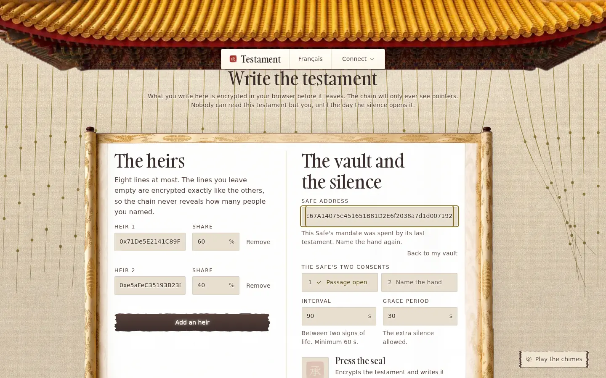
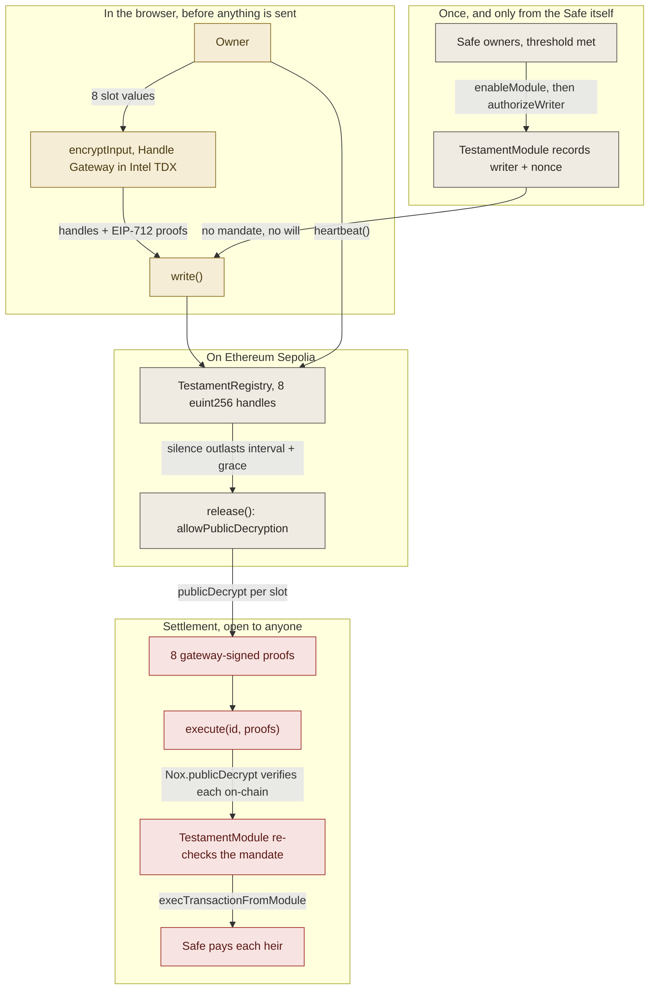

<p align="center"></p>

<h1 align="center">Testament</h1>

<p align="center">
A dead man's switch for a Safe, where the will itself stays encrypted until the moment it
has to execute. Heirs and shares live as Nox handles, and the payout is settled by anyone
at all, because <code>execute()</code> verifies every decryption proof on-chain rather than
trusting whoever sent it.
</p>

Built for the iExec WTF Hackathon, Summer Edition.


-9E2B25)


| Writing the will (the ritual)                    | The door, before anyone may open it            |
| ------------------------------------------------ | ---------------------------------------------- |
|       |    |

## 🎯 The problem

Every Safe has a key-person problem. If the one person who holds the keys dies, the
treasury does not move again. The standard answers are a lawyer who cannot sign a
transaction, a seed phrase in a drawer, or extra signers who can collude while you are
still alive.

The on-chain answer is worse in a specific way: to make a will executable by a contract,
you have to publish it. Anyone can read who inherits and for how much, years before it
happens. That turns a private document into a public target list, and it is why almost
nobody puts a real succession plan on chain.

## 🔐 What it does

- **The will is written encrypted.** Eight slots, each one plaintext packing
  `(uint256(uint160(beneficiary)) << 16) | shareBps`, encrypted in the browser by
  `encryptInput` before anything is sent. The chain stores 32-byte handles.
- **The count is hidden too.** Every testament always writes eight slots. Unused ones carry
  a client-side encrypted zero produced by the same call as a real slot, so nobody can tell
  whether a will names one heir or eight. See
  [`packBequests`](packages/shared/src/slots.ts).
- **The owner can still read their own will.** `Nox.addViewer(slot, msg.sender)` at write
  time, so the app decrypts and shows it back without any key management.
- **Silence is the trigger.** `heartbeat()` resets the clock. Once
  `block.timestamp > lastHeartbeat + interval + grace`, `release()` is open to anyone. A
  late owner is still forgiven, as long as nobody has released yet.
- **The executor is trustless.** `execute()` calls
  [`Nox.publicDecrypt(handle, proof)`](packages/contracts/contracts/TestamentRegistry.sol),
  which forwards to `NoxCompute.validateDecryptionProof` and reverts on a bad signature. The
  keeper in this repo is a courier, not an authority: a beneficiary or a judge can send the
  exact same transaction.
- **The Safe consents twice, and can take it back.** It enables the module once, then names
  the single address allowed to draw a will on it. Both are Safe transactions that clear the
  Safe's own threshold, so neither can be done on its behalf. Enabling a module grants
  unrestricted spending authority over the Safe, which is why the second consent exists: it
  is what stops a stranger naming your module-enabled Safe as the estate paying their own
  testament. The mandate is checked again inside the module at payout, against the Safe's
  state right then, so withdrawing or reassigning it disarms a will already written. The
  registry holds no funds and cannot be repointed: both addresses are `immutable`.
- **Every testament has its own door.** An heir reaches `/porte?id=N` through the link the
  owner shares, surfaced after the seal and on the home page while connected. Without a
  link the door explains itself instead of showing the registry's latest testament, so
  nobody's affairs sit on a public doorstep.
- **The house explains itself.** [`/apropos`](packages/web/src/components/about/AboutScreen.tsx)
  walks the five gestures on the same parchment, each illustrated with a capture of the
  real screen against the rehearsal wallets on Sepolia.
- **The curtain is the countdown.** No DAYS/HRS/MIN widget exists in this product. The
  strands are warm bronze under a live breeze while the heartbeat is recent, cool toward
  pale iron as the silence runs on, and detach and fall once the will is released. Passing
  the cursor through them rings a pentatonic chime, off until you ask for it.
- **French and English**, switchable from the plaque, `lang` kept in step for screen
  readers. Every string lives in [one typed dictionary](packages/web/src/lib/i18n.ts) where a
  missing translation is a compile error.

## 🧭 How it works



Gold, in the browser before anything leaves. Grey, on chain. Red, the irreversible half.

What the diagram cannot show is the failure paths, which are most of the design. The first
one is refusal: `write()` reverts unless the Safe named this exact caller, and the module
refuses again at payout unless the mandate still stands at the same nonce, so a will can
never outlive the authority it was drawn under and one Safe backs at most one live will. A
beneficiary that cannot accept ETH does not abort the payout: the module emits
`DistributionRefused` and keeps going, because a testament gets exactly one execution and
one bad recipient must not strand everyone else's inheritance. An empty Safe makes
`execute()` revert on purpose, leaving the testament released so it can be retried after
funding rather than burning its single execution. Shares that sum to more than 100% are
capped against a running budget instead of reverting, so a malformed will under-distributes
and can never over-distribute. And a revoked testament can never be released, so its slots
are never made publicly decryptable.

### The state machine

| State      | Set by                       | `heartbeat` | `revoke` | `release`     | `execute` |
| ---------- | ---------------------------- | ----------- | -------- | ------------- | --------- |
| `Active`   | `write()`                    | owner only  | owner    | once expired  | no        |
| `Released` | `release()`, permissionless  | no          | no       | no            | anyone    |
| `Executed` | `execute()`, permissionless  | no          | no       | no            | no        |
| `Revoked`  | `revoke()`, owner only       | no          | no       | never         | no        |

## 🔗 Live on Sepolia

> **Superseded, redeploy pending.** The pair below is the version that was audited, and it
> carries a critical flaw: `write()` accepted any Safe address from any caller, so anyone
> could name a module-enabled Safe as the estate paying their own will and drain it one
> minute later. The contracts in this repository fix it (`authorizeWriter`, a per-Safe
> mandate, a rotation nonce re-checked inside the module at payout, one live will per Safe).
> The registry and module hold each other's address as `immutable`, so the fix cannot be
> applied in place: the pair has to be redeployed and this table and its evidence replaced.
> The exact command sequence is under [Reproduce it](#-reproduce-it). Until it has run, read
> this section as the record of what was audited, not as a deployment to trust.

| Artifact            | Address                                      | Link                                                                                             |
| ------------------- | -------------------------------------------- | ------------------------------------------------------------------------------------------------ |
| `TestamentRegistry` | `0x53485D9B64032a085c0D3E61A32ffB47639c106C` | [verified](https://sepolia.etherscan.io/address/0x53485D9B64032a085c0D3E61A32ffB47639c106C#code) |
| `TestamentModule`   | `0x8106384a2eD13C727878FA5c401FD1B72965faC8` | [verified](https://sepolia.etherscan.io/address/0x8106384a2eD13C727878FA5c401FD1B72965faC8#code) |
| Demo Safe (1-of-1)  | `0x4c67A14075e451651B81D2E6f2038a7d1d007192` | [Safe](https://sepolia.etherscan.io/address/0x4c67A14075e451651B81D2E6f2038a7d1d007192)          |

Evidence, a full life cycle run end to end against those addresses:

- **The will goes on chain encrypted.** `write()`, 1,019,109 gas, 8 encrypted slots and
  their proofs:
  [`0x3256fb27`](https://sepolia.etherscan.io/tx/0x3256fb279a7a70021dcb44e3ffcbefb78a169a074e13626467e00dbbe96ff58a)
- **The heartbeat resets the clock:**
  [`0xfcb467d7`](https://sepolia.etherscan.io/tx/0xfcb467d7ea0c58d04aa3fb9ee383e0c47cdd9f144f3093748b027124b319b608)
- **The silence runs out and the will is opened.** `release()`, 279,543 gas, eight slots
  marked publicly decryptable:
  [`0xde5265c0`](https://sepolia.etherscan.io/tx/0xde5265c0ae26b6bfdb55145b0b7b6b9043f36c88046000dc2aba38af36365e44)
- **The estate pays out.** `execute()`, 185,400 gas, eight decryption proofs verified
  on-chain, two `Distributed` events, Safe drained to zero:
  [`0x09817a84`](https://sepolia.etherscan.io/tx/0x09817a84c81a6ea6594d70c92855dd2e80d905bd33ac07ed528a702b54771d85)
- **The negative proof: the system says no to a forged decryption.** The test
  `rejects a forged decryption proof` flips one byte of a gateway signature and asserts the
  transaction reverts. That single test is what makes `execute()` safe to leave open to
  strangers.
  [`testament-registry.test.ts`](packages/contracts/test/testament-registry.test.ts)

## 🧪 Reproduce it

Prerequisites, the exact versions this was built and tested on: Node 22.22.2, Bun 1.3.14,
Docker (the Nox plugin boots its offchain stack in containers), solc 0.8.35, Hardhat 3.11.1,
Next.js 16.2.12.

```bash
git clone https://github.com/Andy00L/testament-nox.git
cd testament-nox
bun install

# The confidential contracts, against the local Nox stack in Docker.
# First run pulls the images and takes a few minutes.
bun run --cwd packages/contracts test

# The slot codec, no chain and no Docker needed.
bun run --cwd packages/shared test
```

Success is `59 passing` from the contract suite and `21 pass, 0 fail` from the codec suite.
Both exit non-zero on any failure. Seventeen of those contract tests are the authorization
boundary on its own: an outsider is refused, an unnamed owner is refused, a withdrawn or
rotated mandate cannot pay out, and one Safe never backs two live wills.

To run it against Sepolia yourself, copy `packages/contracts/.env.example` to `.env`, fill
in a funded throwaway key, then:

```bash
cd packages/contracts

# Retiring a previous pair first: an enabled module keeps unrestricted spending authority
# over the Safe forever, so deploying a replacement does not remove what it replaces.
DISABLE_MODULE_ADDRESS=0x<old module> bun run disable-module:sepolia

bun run deploy:sepolia          # deploys the pair, writes the addresses back into .env
bun run create-safe:sepolia     # creates and funds a 1-of-1 Safe you own
bun run enable-module:sepolia   # the Safe opens the passage
bun run authorize-writer:sepolia # the Safe names the deployer as its writer
bun run e2e:sepolia             # write, heartbeat, wait out the silence, release, execute
```

`enable-module` and `authorize-writer` are two separate Safe transactions on purpose, and
`e2e:sepolia` refuses to start without both. Batch them through MultiSend to keep it to one
signature, `enableModule` first.

`e2e:sepolia` deploys nothing and tops the Safe back up if a previous run drained it, so it
is repeatable. It exits non-zero unless both heirs receive exactly their share and the
testament ends in `Executed`.

The front end:

```bash
cp packages/web/.env.local.example packages/web/.env.local   # then fill the two addresses
bun run --cwd packages/web build && bun run --cwd packages/web start
```

Use the production build, not `next dev`: on some WSL2 setups the Turbopack HMR socket never
completes its handshake and the page then never hydrates, which leaves the canvas blank.

## ⚠️ What is real, and what is not

- **Nothing is mocked on the confidentiality path.** Real Nox handles, real Handle Gateway,
  real on-chain proof verification, real Safe, real payout. The only test doubles are
  `MockSafe` and `RejectingReceiver`, and they exist solely inside the contract test suite.
- **A Safe module is all or nothing, and the mandate narrows who, not how much.** Enabling
  TestamentModule lets it move the Safe's entire native balance; Safe's module interface
  offers no spending cap. The mandate decides whose will it will act on and nothing else, so
  naming a writer is trusting that person with the whole distribution, the way signing a
  paper will over to a solicitor is. Name your own wallet unless you mean otherwise.
- **A withdrawn mandate stops a payout, it does not erase the will.** `revokeWriter` leaves
  the testament sitting in the registry, released and unpayable. Only the owner's own
  `revoke()` clears the record and frees the Safe to back a new one.
- **Confidentiality is not anonymity, and Nox does not claim otherwise.** That an address
  wrote a testament is public. Which Safe it points at is public. The heartbeat cadence and
  every heartbeat's timing are public. Hidden until release: who inherits, how much, and how
  many people are named.
- **The interval and grace are deliberately public.** Encrypting them would mean the
  contract could not evaluate its own release condition without a decryption round trip on
  every check. This is a design limitation of gating a state transition on encrypted data,
  and it is written up in [feedback.md](feedback.md).
- **After release the will is public, by construction.** Paying plain addresses is a public
  act. An ERC-7984 confidential payout would fix this and is not built.
- **A beneficiary contract that burns all the gas can still block the batch.**
  `execTransactionFromModule` offers no gas cap, so this is inherent to the Safe module
  interface. A recipient that merely *reverts* is handled (see `DistributionRefused`).
- **The trust root is Intel TDX plus its attestation chain**, not mathematics alone. See
  [Nox's chain of trust](https://docs.noxprotocol.io/protocol/chain-of-trust).
- **The demo timings are 90 s interval and 30 s grace**, set in `.env` so a video can be
  recorded. Contract floor is `MIN_INTERVAL = 60` seconds; sane production values are days.
- **Payouts are native ETH only.** ERC-20 is not built.
- **The keeper is optional and holds nothing.** It is a convenience so a demo settles while
  nobody is watching. Every action it takes is open to anyone.

## 📦 Repository layout

```
packages/contracts/   TestamentRegistry, TestamentModule, ISafe, test doubles, deploy and e2e scripts
packages/shared/      Slot codec, testament state maths, Nox and Safe helpers, generated ABIs
packages/keeper/      Permissionless watcher that releases and executes. No authority
packages/web/         Next.js front end: the curtain, the ritual, the door
docs/                 UI design system, icon, screenshots
inputs/nox-docs/      The Nox documentation frozen at build time, 35 pages
ARCHITECTURE.md       SPIKE decisions and every divergence from the original plan, with sources
feedback.md           DX notes on Nox, for iExec
```

## 🏗 Existing work, declared

Required by the hackathon rules. Everything else in this repository was written during the
event.

- **[iExec Nox](https://docs.noxprotocol.io)**: `@iexec-nox/nox-protocol-contracts@0.2.4`,
  `@iexec-nox/handle@0.1.0-beta.13`, `@iexec-nox/nox-hardhat-plugin@0.1.0`. The confidential
  primitive. `test/utils/handle-gateway.ts` is adapted from
  [`nox-hardhat-starter`](https://github.com/iExec-Nox/nox-hardhat-starter) (MIT), rewritten
  for the plugin's `handleGatewayUrl()` and batched over several handles.
- **[Safe](https://github.com/safe-global/safe-smart-account) v1.4.1**: canonical singleton,
  proxy factory and fallback handler, used as deployed on Sepolia. `ISafe.sol` is a
  hand-written two-function interface, not a copied dependency.
- **[OpenZeppelin](https://github.com/OpenZeppelin/openzeppelin-contracts) 5.6.1**:
  `ReentrancyGuard`.
- **Curtain physics** adapted from Liam Egan's
  ["Strings" CodePen](https://codepen.io/shubniggurath/pen/xbwOJye) (MIT): the pinned-top
  Verlet chain structure and the radial pointer force. Rewritten against a fixed timestep so
  the curtain behaves the same on a 60Hz and a 144Hz display.
  See [`verlet.ts`](packages/web/src/scene/verlet.ts).
- **Artwork by [Marina Budarina](https://budarina.design), used with her permission.**
  The tatami field (`public/scene/tatami.webp`) and the painted double-eave roof
  (`public/scene/roof.webp`) come from her
  [chimes project](https://marinabudarina.github.io/chimes/#home), re-encoded to WebP at
  render size by [`optimise-scene-assets.ts`](packages/web/scripts/optimise-scene-assets.ts)
  and otherwise unmodified. Her repository is marked "all rights reserved"; permission to use
  these two files in this project was requested and granted by the author directly. No other
  asset, copy, or code from that project is used here. The ink values her stylesheet defines
  informed this project's palette so the drawn elements and the photographic ones sit in one
  colour world. Her site is worth visiting on its own terms.
- **Type**: [Gambarino](https://www.fontshare.com/fonts/gambarino) from Fontshare and a
  two-glyph subset of Noto Serif SC, both self-hosted.
- **The transmission illustration** on the door page (an elder passing a sword to a bowing
  heir) is an AI-generated image (Google Gemini) supplied by the team. Its baked-in
  checkerboard background is removed at build time by a border flood fill in
  [`optimise-scene-assets.ts`](packages/web/scripts/optimise-scene-assets.ts), which spares
  the enclosed light details a colour key would erase.

## 📜 License

MIT. See [LICENSE](LICENSE).
